# 🚀 SnapEats – Food Delivery App (Android | Java | Firebase)

*A clean, scalable, production-inspired food delivery application built with modern Android development practices.*

---

## 🔥 Overview

SnapEats is a feature-rich food delivery application designed with **modern UI/UX**, **clean architecture principles**, and **real Firebase backend integration**. The app demonstrates professional Android development skills through:

* Clean code architecture
* Firebase Realtime Database integration
* RecyclerView + Adapters
* Glide image loading
* Modular and scalable structure
* Real-world e-commerce features

---

## 🎯 Why This Project Stands Out

* Industry-level UI/UX
* Firebase-backed data architecture
* Clean, modular project structure
* Professional branding (Logo-based Yellow + Green palette)
* Demonstrates full end-to-end Android development
* Interview-ready & recruiter-friendly code

---

## 🚀 Features

### 🏠 Home Screen

* Dynamic categories
* Popular & Recommended items
* Firebase-driven data loading
* Wishlist toggle synced across app

### 🔍 Search

* Material SearchBar + SearchView
* Auto illustration for empty state
* Smooth animations

### ❤️ Wishlist System

* Add/remove items
* Persistent wishlist state

### 🛒 Cart & Checkout

* Add to cart
* Quantity update
* Order summary UI
* Modern checkout layout

### 🔐 Authentication

* Firebase Email/Password Authentication
* Secure login & signup with validation
* Forgot Password (email reset)
* Auto-login using persistent session
* Logout with confirmation dialog

### 👤 Profile Module

* The SnapEats profile section provides users with complete control over their account settings.

  ### User Information

  * View & update personal details: **Name, Gender, Phone Number, Profile Image**
  * Securely synced with Firebase

  ### Address Management

  * Add, edit, and delete delivery addresses
  * BottomSheet UI for adding new addresses
  * Supports multiple saved locations

  ### Order History

  * Displays all completed/past orders
  * Shows items, total amount, and delivery status

  ### Static Payment Method Screen

  * Shows available payment methods (UI only)
  * Ready for future payment integration

  ### Logout

  * Secure Firebase Auth logout
  * Confirmation BottomSheet
  * Redirects to Login screen

---
---

# 📸 App Screenshots

| Login | Home | Categories | Popular Food |
|-------|------|------------|--------------|
| 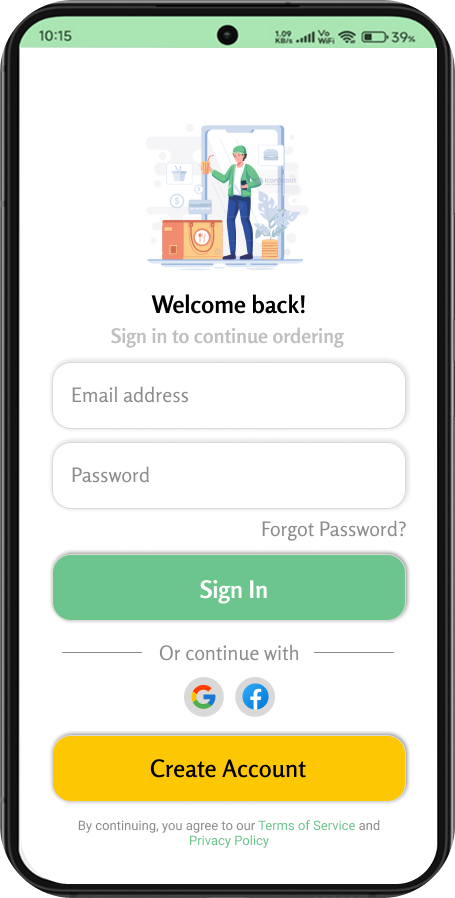 | 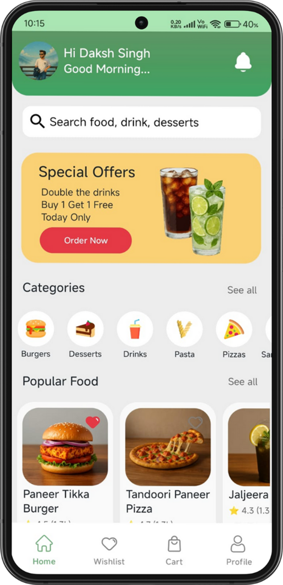 | 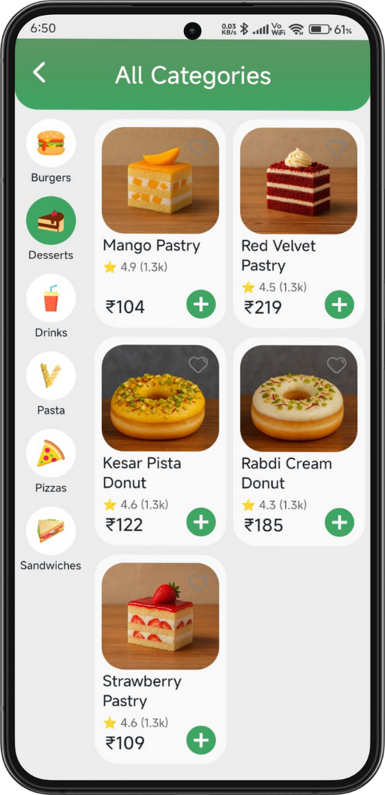 | 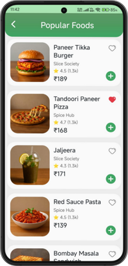 |

| Search | Food Details | Wishlist  | Cart |
|--------|--------------|-----------|------|
| 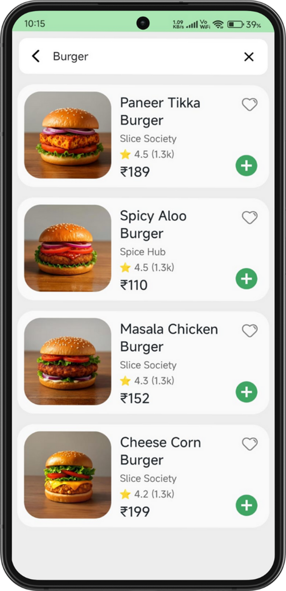 | 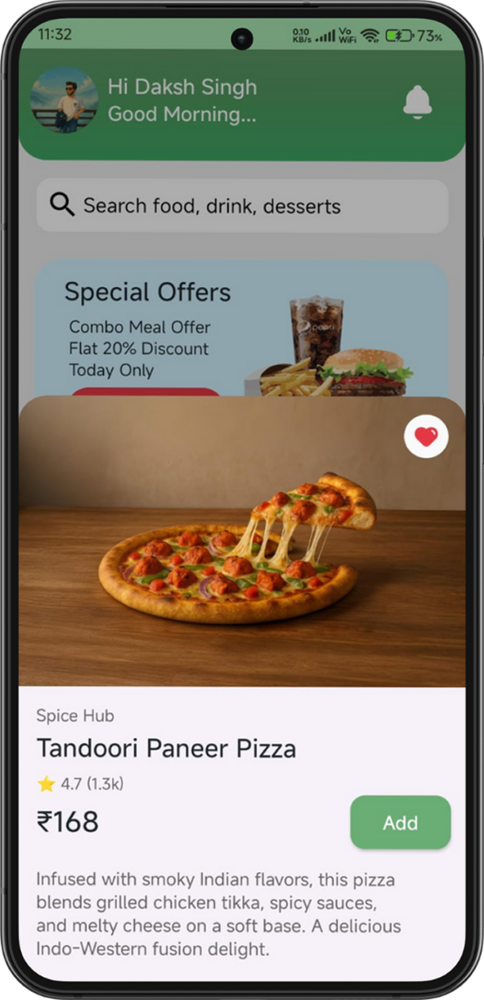 | 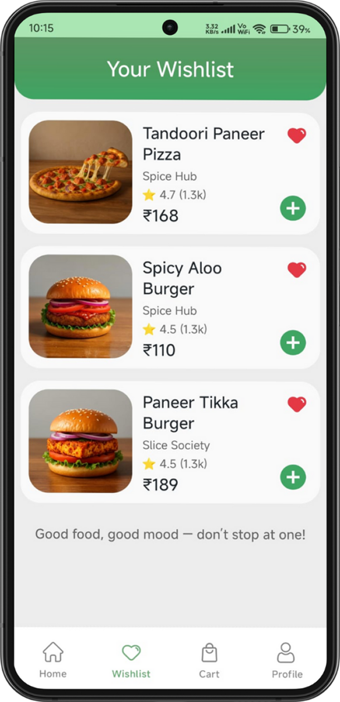 | 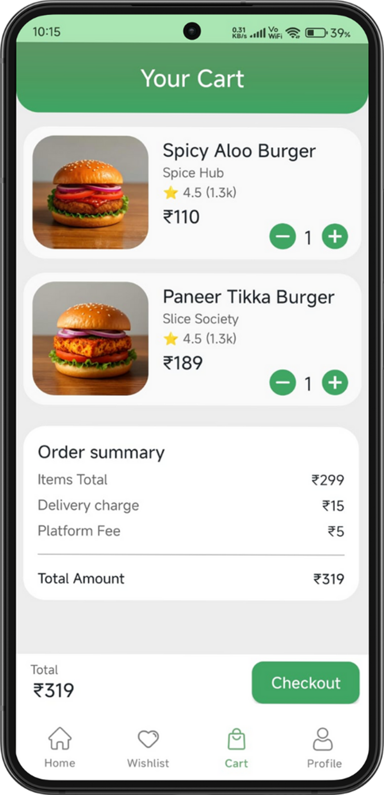 |

| Address | Checkout | Payment | Orders |
|----------|----------|---------|--------|
| 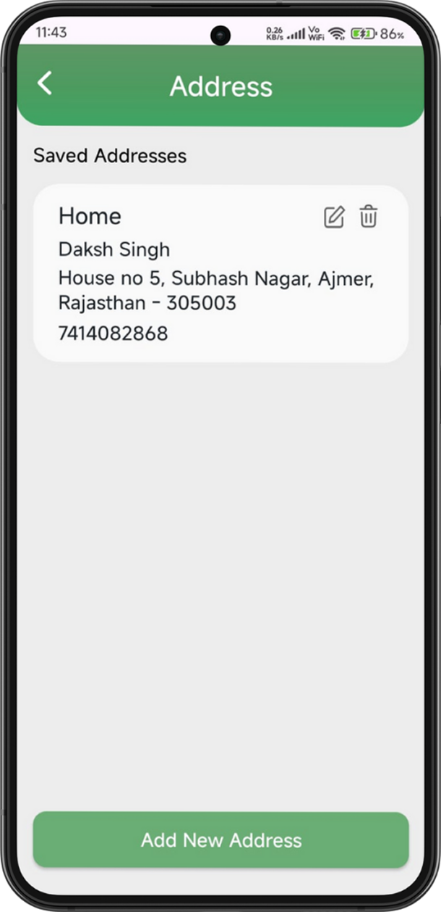 | 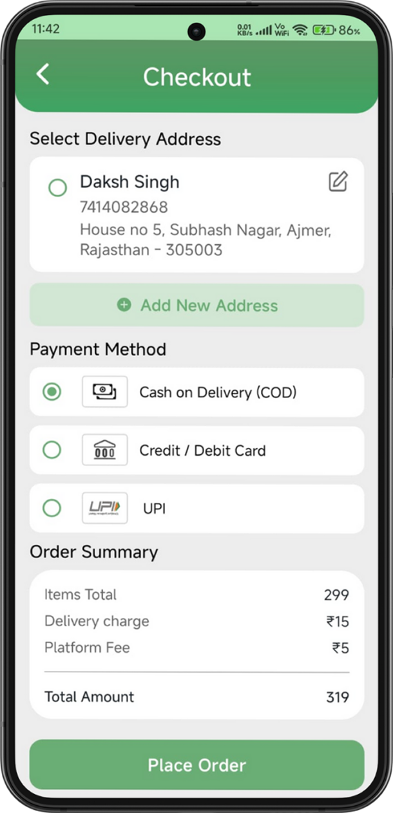 | 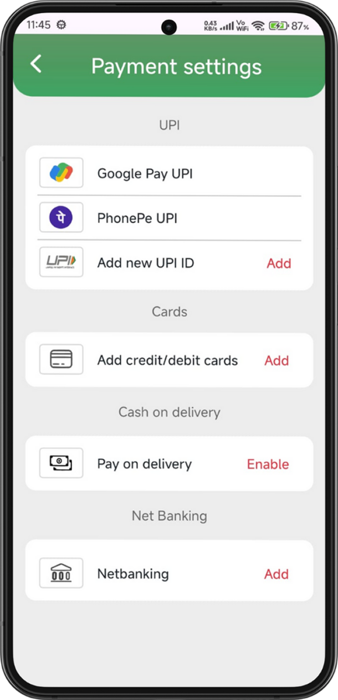 | 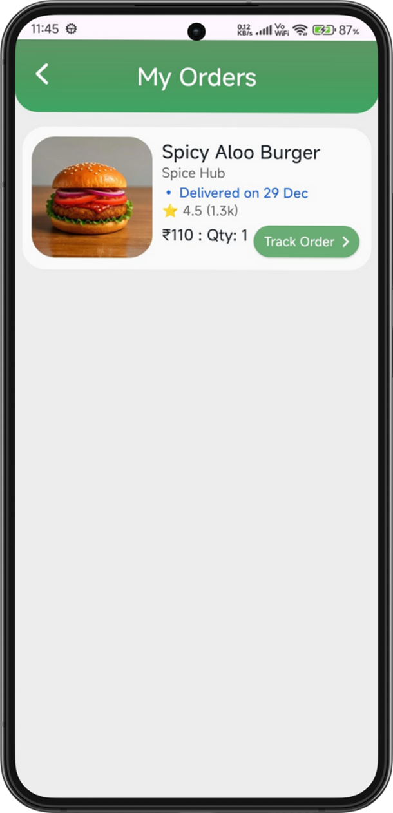 |

| Profile | Edit Profile | Logout |
|---------|--------------|--------|
| 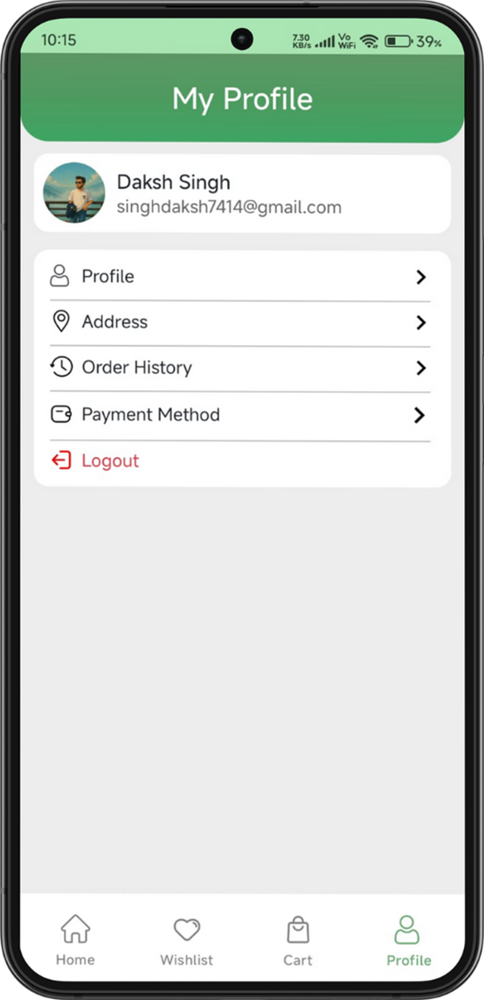 | 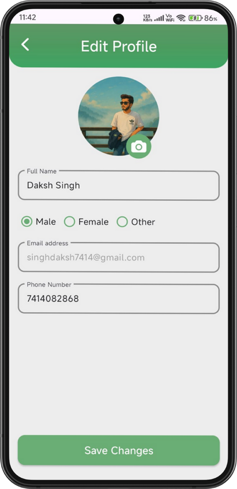 | 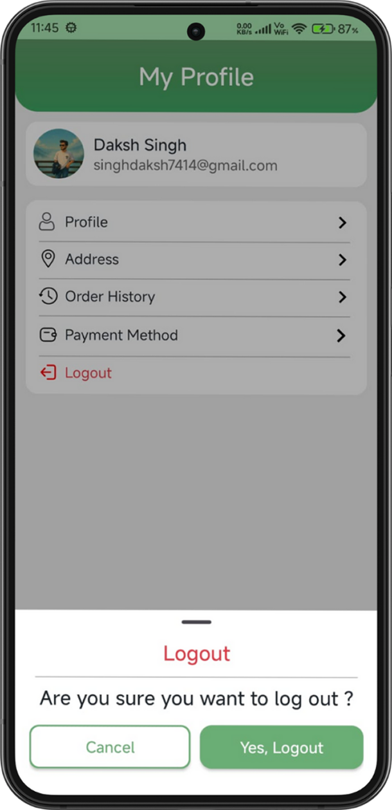 |

---


## 🛠 Tech Stack

| Layer           | Technology                                |
| --------------- | ----------------------------------------- |
| Language        | **Java**                                  |
| UI              | **XML**, Material Components              |
| Backend         | **Firebase Realtime Database**            |
| Architecture    | Modular Activities + Fragments + Adapters |
| Image Loading   | Glide                                     |
| Version Control | Git & GitHub                              |


---

## 🎨 Design System

**SnapEats Brand Palette:**

* Primary Green: `#6BAE75`
* Secondary Green: `#5E9767`
* Surface: `#ededed`

UI inspired by Blinkit, Swiggy & Zomato.

---

## ⚙️ How to Run

### 1️⃣ Clone

```bash
git clone https://github.com/Daksh-7414/SnapEats.git
```

### 2️⃣ Open in Android Studio

Allow Gradle to sync.

### 3️⃣ Add Firebase

* Add `google-services.json` in `/app`
* Enable Firebase Realtime Database

### 4️⃣ Run

Build and run on emulator or device.


## 🧪 Future Scope

1. **Create an Admin App / Admin Panel**
   For managing food items, orders, users, offers, analytics, and dashboards.
2. **Migrate to Modern Technologies (Kotlin + Jetpack Compose)**
   Convert the entire app into a fully modern Android stack using:

   * Kotlin
   * Jetpack Compose
   * MVVM / Clean Architecture
   * Retrofit + Coroutines
   * Jetpack Navigation
   * Hilt for Dependency Injection
3. **Integrate a Secure Payment Gateway**
   Add online payments using Razorpay / Paytm / Stripe for seamless checkout.
4. **Implement Real-time Order Tracking**
   Using Firebase Realtime Database / WebSockets to show live status updates:

   * Order Received
   * Being Prepared
   * Out for Delivery
   * Delivered

---

## 🏆 What This Project Demonstrates

* Ability to build full Android apps independently
* Professional UI design practices
* Firebase-backed data flow
* Reusable adapters & models
* Real e-commerce logic (cart, wishlist)
* Strong development fundamentals

---

## 👨‍💻 Developer

**Daksh Singh**  

Android Developer | Kotlin | Jetpack Compose | Firebase | Room | Hilt

🔗 LinkedIn: https://www.linkedin.com/in/daksh-singh82/

---
